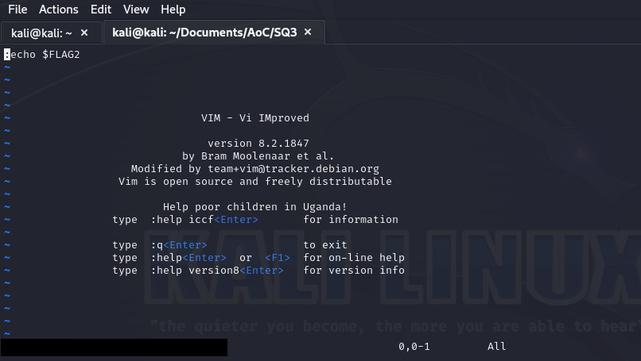

# Frosteau Busy with Vim


## Frosteau's Laptop
Heh, well done! You've clawed your way through the CyberPolice's outer defenses. But don't get too cozy yet, you're still a pup in this pack with only limited reach in their network. If you wanna run with the big yetis, you gotta ice Frosteau's machine. That's where the juicy bits hide, all those case files, the whole stash. With that, you'll be howlin' with insight into their network. But keep your eyes peeled; Frosteau's no lone wolf, and with Elf McSkidy by his side, they've snuffed your trail before. Tread light, tread smart, stay frosty!

### The Yeti Updates
After the first few of the Yeti’s crew got through Cyber Police defences quickly, McSkidy helped lock down the system. With a new update in place, they think they’re safe!

This challenge machine was updated with a new version about 12 hours after release. After locking down an unintended path, the challenge is considerably more difficult, bringing it back to the original design. At the time of the update, 21 people had already finished the challenge and found the Yeti Key. As a result, and to keep it fair, the Yeti offers you a hint for one of the questions below. Your choice if you want to use it!

In addition to the 3 winner prizes for the first finishers of the room, we will award three additional prize packages to the first three people to complete the challenge after the update! Before you claim this prize, we’ll email you to verify you have solved the updated version of the challenge.

### Questions
1. What is the value of the first flag?
2. What is the value of the second flag?
3. What is the value of the third flag?
4. What is the value of the fourth flag?
5. What is the value of the third Yetikey that has been placed in the root directory to verify the compromise?

## Writeup

### Reconaissance
First things first, let's launch the challenge VM and see what we're working with.

```
PORT     STATE SERVICE VERSION
22/tcp   open  ssh     OpenSSH 8.2p1 Ubuntu 4ubuntu0.9 (Ubuntu Linux; protocol 2.0)
80/tcp   open  http    WebSockify Python/3.8.10
8065/tcp open  telnet  BusyBox telnetd 1.14.0 or later
8075/tcp open  ftp     BusyBox ftpd (D-Link DCS-932L IP-Cam camera)
8085/tcp open  telnet  BusyBox telnetd 1.14.0 or later
8095/tcp open  telnet  BusyBox telnetd 1.14.0 or later
```

#### Port 22
We don't have much to exploit yet.

#### Port 80

#### Port 8065

#### Port 8075
A fairly straightforward FTP server allowing anonymous logins.

#### Port 8085
Seems we have `vim` running here.

#### Port 8095
Seems we have `nano` running here.

### FTP Enumeration
Let's connect to the FTP server running on port 8075 and see what we can find.

```
ftp 10.10.237.123 8075
Connected to 10.10.237.123.
220 Operation successful
Name (10.10.237.123:kali): anonymous
230 Operation successful
Remote system type is UNIX.
Using binary mode to transfer files.
ftp> ls
229 EPSV ok (|||34629|)
ftp: Can't connect to `10.10.237.123:34629': Connection refused
200 Operation successful
150 Directory listing
total 8132
-rw-r--r--    1 0        0             3010 Nov  5 18:49 FROST-2247-SP.txt
-rw-r--r--    1 0        0             3211 Nov  5 18:50 YETI-1125-SP.txt
-rw-r--r--    1 0        0               24 Nov  5 19:06 flag-1-of-4.txt
-rw-r--r--    1 0        0               12 Nov  5 19:07 flag-2-of-4.sh
-rw-r--r--    1 0        0          2127524 Nov  5 18:54 frostling_base.png
-rw-r--r--    1 0        0          2305908 Nov  5 18:54 frostling_five.png
-rw-r--r--    1 0        0          1589463 Nov  5 18:54 yeti_footage.png
-rw-r--r--    1 0        0          2277409 Nov  5 18:54 yeti_mugshot.png
226 Operation successful
ftp> get flag-1-of-4.txt
local: flag-1-of-4.txt remote: flag-1-of-4.txt
200 Operation successful
150 Opening BINARY connection for flag-1-of-4.txt (24 bytes)
100% |*****************************************************************************************|    24        0.41 KiB/s    00:00 ETA
226 Operation successful
24 bytes received in 00:00 (0.41 KiB/s)
ftp> get flag-2-of-4.sh
local: flag-2-of-4.sh remote: flag-2-of-4.sh
200 Operation successful
150 Opening BINARY connection for flag-2-of-4.sh (12 bytes)
100% |*****************************************************************************************|    12      160.53 KiB/s    00:00 ETA
226 Operation successful
12 bytes received in 00:00 (29.37 KiB/s)
```

Viewing the contents of `flag-1-of-4.txt`, we get our first flag: `THM{Let.the.game.begin}`

Our second file of note, `flag-2-of-4.sh` is a little more interesting: `echo $FLAG2`.  Looks like we're going to need something other than FTP to execute commands and view an environment varible.

### Let's Play With vim
`nc 10.10.237.123 8085` will get us into vim.  Reading some vim documention at https://learnvimscriptthehardway.stevelosh.com/chapters/01.html, it would appear we can utilize its internal `:echo` command.



There's flag 2: `THM{Seems.like.we.are.getting.busy}`
